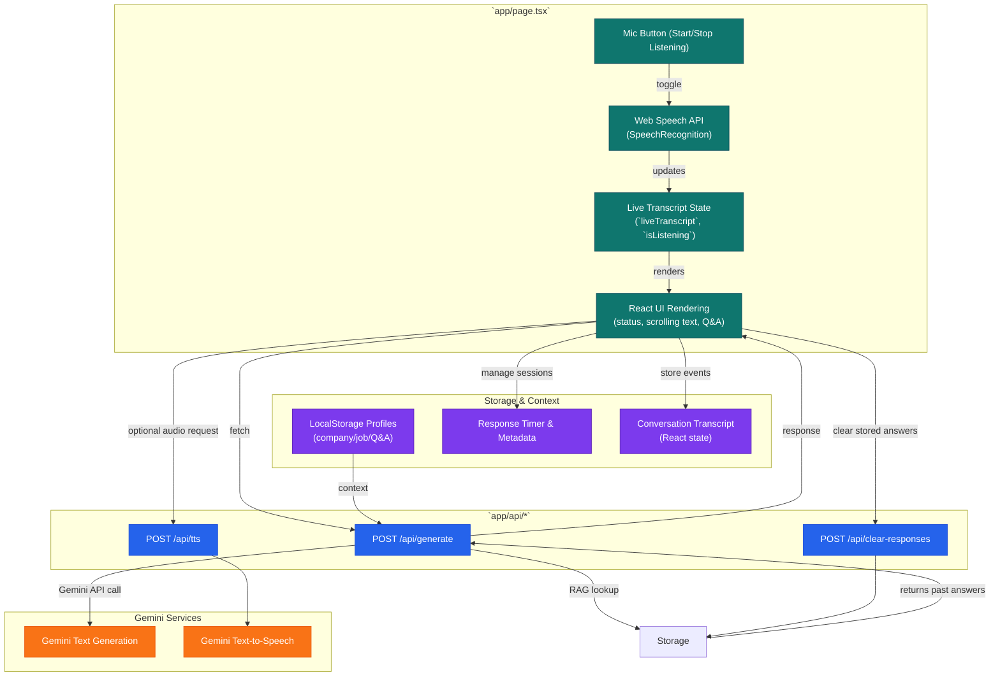

# AI Interview Assistant

A sophisticated AI-powered interview preparation application that uses Retrieval-Augmented Generation (RAG) to provide context-aware, personalized interview responses. Built with Next.js, React, TypeScript, and Google's Gemini AI.

## 🎯 Overview

This application helps candidates prepare for technical interviews by:
- Retrieving relevant experiences from a knowledge base using semantic search
- Providing personalized responses tailored to specific job profiles
- Supporting both traditional Q&A interviews and procedural/practical interviews
- Maintaining consistency across multiple interview rounds
- Tracking response times and optimizing answer delivery

## ✨ Key Features

### 🧠 Retrieval-Augmented Generation (RAG)
- **Semantic Search**: Uses Gemini's embedding model (`models/embedding-001`) to find the most relevant experiences and technical Q&A pairs
- **Dynamic Context**: Retrieves top 5 relevant experiences and top 3 technical Q&A pairs per question
- **Efficient Storage**: Uses ChromaDB for vector storage and similarity search
- **Scalable**: Easily add new experiences and Q&A without modifying code

### 📋 Dual Interview Modes

#### 1. Question & Answer Interview (Q&A)
- Traditional interview format with conversational responses
- Context-aware scrolling text display
- Code block extraction and highlighting
- Voice input with speech recognition
- Text-to-speech audio responses

#### 2. Procedural Interview Steps
- Step-by-step process explanations
- Syntax highlighting for commands and code
- Cloud service-specific instructions (AWS, Azure, GCP)
- Framework-based responses (SANS Incident Response, SDLC, RMF)
- First-person, action-oriented descriptions

### 🏢 Profile Management
- **Multiple Company Profiles**: Create and manage profiles for different companies
- **Job-Specific Context**: Store job descriptions, company information, and technical requirements per profile
- **Custom Technical Q&A**: Add profile-specific questions and answers that are automatically retrieved during interviews
- **Profile-Based Storage**: Responses are stored and retrieved per profile for consistency

### 🎯 Interview Round Selection
- **Round Tracking**: Select interview rounds 1-7
- **Separate Storage**: Questions and responses stored separately per round
- **Round-Specific Consistency**: Maintains consistent answers within the same round
- **Easy Switching**: Toggle between rounds with a single click

### 💾 Response Storage & Consistency
- **Automatic Storage**: All generated responses are stored in ChromaDB
- **Similarity Matching**: Retrieves stored responses for similar questions (85% similarity threshold)
- **Round & Profile Filtering**: Responses filtered by interview round and profile
- **Clear Functionality**: Clear stored responses for testing or specific rounds/profiles

### ⏱️ Response Timer
- **Precise Measurement**: Tracks time from question finalization to response display
- **Visual Feedback**: Displays elapsed time in real-time
- **Performance Tracking**: Helps optimize response generation speed
- **WPM Display**: Shows reading speed in words per minute (WPM)

### 🎨 Enhanced User Experience
- **Context-Aware Scrolling**: Adjusts scrolling speed based on punctuation and natural pauses
- **Code Block Highlighting**: Automatically extracts and highlights code snippets
- **Pause Indicators**: Visual markers for reviewing technical commands
- **Adjustable Reading Speed**: Customize scrolling speed (5-30 chars/sec with WPM display)
- **Conversation Transcript**: Full conversation history with timestamps
- **Deepen & Clarify**: Request deeper answers or clarification on responses

### 🔍 Procedural Knowledge Lookup
- **Framework Detection**: Automatically detects procedural questions (Incident Response, SDLC, RMF)
- **Contextualized Responses**: Uses Gemini to personalize framework responses to specific scenarios
- **First-Person Voice**: Generates action-oriented, first-person responses
- **Cloud-Specific**: Incorporates cloud platforms and tools mentioned in questions

## 🛠️ Tech Stack

### Frontend
- **Next.js 16** - React framework with App Router
- **React 19** - UI library
- **TypeScript 5** - Type-safe JavaScript
- **Tailwind CSS 4** - Utility-first CSS framework

### Backend
- **Next.js API Routes** - Serverless API endpoints
- **ChromaDB** - Vector database for embeddings
- **Google Gemini AI** - Text generation (`gemini-2.5-flash-preview-09-2025`)
- **Gemini TTS** - Text-to-speech (`gemini-2.5-flash-preview-tts`)
- **Gemini Embeddings** - Semantic search (`models/embedding-001`)

### Data Processing
- **Python 3** - Data ingestion scripts
- **LangChain** - Text chunking and splitting
- **FastAPI** - Optional Python API server (deprecated in favor of direct ChromaDB)

## 📦 Installation

### Prerequisites
- Node.js 18+ and npm
- Python 3.8+ and pip
- Google Gemini API key ([Get one here](https://aistudio.google.com/app/apikey))

### Setup Steps

1. **Clone the repository**
   ```bash
   git clone <repository-url>
   cd ai-eng-app
   ```

2. **Install Node.js dependencies**
   ```bash
   npm install
   ```

3. **Install Python dependencies**
   ```bash
   pip install -r requirements.txt
   ```

4. **Set up environment variables**
   
   Create a `.env.local` file in the root directory:
   ```bash
   GEMINI_API_KEY=your_gemini_api_key_here
   ```

5. **Initialize the vector database**
   
   **For experiences:**
   ```bash
   python ingest.py
   ```
   
   **For technical Q&A:**
   ```bash
   python ingest_technical_qa.py
   ```
   
   These scripts will:
   - Load data from JSON files (`experiences.json`, `technical_qa.json`)
   - Generate embeddings using Gemini's embedding model
   - Store vectors in `./chroma_db/` directory

6. **Start the development server**
   ```bash
   npm run dev
   ```

7. **Open your browser**
   
   Navigate to [http://localhost:3000](http://localhost:3000)

### Desktop Assistant (Electron)

For a desktop experience with continuous listening:

1. Install dev dependencies:
   ```bash
   npm install --save-dev electron electron-builder concurrently cross-env wait-on ts-node
   ```
2. Start the desktop app during development (runs Next.js and Electron together):
   ```bash
   npm run dev:electron
   ```
3. Use `Ctrl+Shift+L` (or `Cmd+Shift+L` on macOS) to toggle the continuous listener when running the Electron app. The "Continuous Listener" card in the UI also provides a start/stop toggle.
4. To package the desktop app:
   ```bash
   npm run electron:package
   ```
   Configure `electron-builder` targets in `package.json` if you need specific OS binaries.

The Electron build reuses the existing Next.js UI and enables a background listener that feeds transcripts back into the app automatically.

## 📖 Usage Guide

### Creating a Company Profile

1. Click **"Manage Profiles"** or use the profile dropdown
2. Click **"Create New Profile"**
3. Fill in:
   - **Company Name**: The name of the company
   - **About Company**: Background information about the company
   - **Job Description**: The specific job you're interviewing for
   - **Technical Information**: Technical details relevant to the role
4. Click **"Save Profile"**

### Adding Technical Q&A

1. Open a profile
2. In the **"Technical Q&A"** section, enter:
   - **Question**: The interview question
   - **Answer**: Your prepared answer (can include code snippets)
3. Click **"Add Q&A"** to add more pairs
4. Q&A pairs are automatically saved and used during interviews

### Conducting an Interview

#### Q&A Mode
1. Select your interview mode: **"Question and Answer Interview"**
2. Select the interview round (1-7)
3. Select or create a company profile
4. Ask questions via:
   - **Voice**: Click the microphone button and speak
   - **Text**: Type your question and click "Ask Question"
5. Review the scrolling response
6. Use **"Go Deeper"** or **"Ask for Clarification"** buttons as needed

#### Procedural Mode
1. Select your interview mode: **"Procedural Interview Steps"**
2. Select the interview round (1-7)
3. Select a company profile
4. Ask procedural questions (e.g., "Walk me through incident response for an AWS security breach")
5. Review the step-by-step response with highlighted commands

### Managing Stored Responses

- **View Count**: The stored response count is displayed in the UI
- **Clear Responses**: Click **"Clear Stored Responses"** to remove stored responses for:
  - Current profile only
  - Current interview round only
  - Both filters combined

### Adjusting Reading Speed

- Use the **Speed slider** to adjust character-per-second scrolling speed
- WPM (Words Per Minute) is calculated and displayed automatically
- Recommended speeds:
  - **Slow**: 5-10 chars/sec (~60-120 WPM)
  - **Medium**: 11-19 chars/sec (~132-228 WPM)
  - **Fast**: 20-30 chars/sec (~240-360 WPM)

## 📁 Project Structure

```
ai-eng-app/
├── app/
│   ├── api/
│   │   ├── generate/
│   │   │   └── route.ts          # Main API route for text generation
│   │   ├── tts/
│   │   │   └── route.ts          # Text-to-speech API route
│   │   ├── clear-responses/
│   │   │   └── route.ts          # Clear stored responses API
│   │   └── rag_utils.ts          # RAG utility functions (retrieval, storage)
│   ├── page.tsx                  # Main frontend component
│   ├── layout.tsx                # App layout
│   └── globals.css               # Global styles
├── utils/
│   └── procedural-lookup.ts     # Procedural framework lookup utility
├── experiences.json              # User experiences database
├── technical_qa.json             # Technical Q&A database
├── procedural_data.json          # Procedural frameworks (SANS, SDLC, RMF)
├── ingest.py                    # Python script to ingest experiences
├── ingest_technical_qa.py       # Python script to ingest technical Q&A
├── rag_api.py                   # Optional FastAPI server (deprecated)
├── chroma_db/                   # ChromaDB vector database (generated)
├── package.json                 # Node.js dependencies
├── requirements.txt             # Python dependencies
├── tsconfig.json                # TypeScript configuration
├── next.config.ts               # Next.js configuration
└── README.md                    # This file
```

## 🔌 API Endpoints

### System Diagram



### POST `/api/generate`
Generates AI responses using RAG and Gemini.

**Request Body:**
```json
{
  "prompt": "Interview question: What is your experience with cloud security?",
  "technicalQAs": [
    {
      "question": "How do you secure AWS resources?",
      "answer": "I use IAM roles, Security Groups, and CloudTrail..."
    }
  ],
  "interviewMode": "qa",
  "interviewRound": 1,
  "profileId": "profile-123"
}
```

**Response:**
```json
{
  "candidates": [{
    "content": {
      "parts": [{
        "text": "Generated response text..."
      }]
    }
  }]
}
```

### POST `/api/tts`
Converts text to speech using Gemini TTS.

**Request Body:**
```json
{
  "text": "Your response text here"
}
```

**Response:**
```json
{
  "audioData": "base64_encoded_audio_data"
}
```

### POST `/api/clear-responses`
Clears stored responses for a specific profile and/or round.

**Request Body:**
```json
{
  "profileId": "profile-123",
  "interviewRound": 1
}
```

**Response:**
```json
{
  "success": true,
  "message": "Cleared 5 stored response(s) for profile from round 1",
  "count": 5
}
```

### GET `/api/clear-responses?profileId=...&interviewRound=...`
Gets the count of stored responses (filtered by profile and/or round).

### POST `/api/generate-image`
Generates a character concept image using Google's Gemini models.

**Request Body:**
```json
{
  "prompt": "Full-body turnaround of a heroic airship pilot in dieselpunk attire",
  "draftMode": true,
  "style": "cartoon",
  "aspectRatio": "1:1",
  "negativePrompt": "No text, avoid heavy shadows",
  "characteristics": {
    "height": "Tall, heroic proportions",
    "physique": "Athletic, confident stance",
    "clothing": "Dieselpunk flight suit with brass accents"
  },
  "characterId": "nova-ashe"
}
```

**Behaviour:**
- When `draftMode` is `true`, the endpoint uses the faster model specified by `GEMINI_DRAFT_IMAGE_MODEL` (defaults to `gemini-1.5-flash`) to provide quick concept drafts.
- When `draftMode` is `false` or omitted, the higher-quality model referenced by `GEMINI_IMAGE_MODEL` (defaults to `imagen-3.0-pro`) is used for final renders.
- `style` accepts `cartoon`, `3d-soft`, `cel-shaded`, `anime`, `hyper-realistic`, or `custom` (default).
- `characteristics` is optional; supplied fields are folded into the design brief.

**Response:**
```json
{
  "provider": "gemini",
  "draftMode": true,
  "model": "gemini-1.5-flash",
  "characterId": "nova-ashe",
  "style": "cartoon",
  "image": {
    "base64Data": "<base64 image>",
    "mimeType": "image/png",
    "safetyRatings": []
  }
}
```

## 📝 Adding Content

### Adding New Experiences

1. Edit `experiences.json`:
```json
{
  "title": "Project Title",
  "company": "Company Name",
  "description": "Detailed STAR-format description of your experience..."
}
```

2. Run the ingestion script:
```bash
python ingest.py
```

3. The script will prompt to recreate the collection - confirm to update

### Adding Technical Q&A

1. Edit `technical_qa.json`:
```json
{
  "id": 10,
  "question": "Your technical question here",
  "answer": "Your detailed answer here. Include code snippets, commands, or queries as needed.",
  "tags": ["Tag1", "Tag2", "Tag3"],
  "category": "Category Name"
}
```

2. Run the ingestion script:
```bash
python ingest_technical_qa.py
```

### Adding Procedural Frameworks

1. Edit `procedural_data.json`:
```json
{
  "id": "framework-id",
  "title": "Framework Name",
  "summary": "Brief summary of the framework",
  "phases": [
    {
      "phase_number": 1,
      "phase_name": "Phase Name",
      "description": "Detailed action-oriented description..."
    }
  ]
}
```

2. The framework will be automatically available for procedural questions

### General Knowledge Base (Optional)

To preload common technical notes (e.g., TLS versions, Azure networking, HTTP status codes), edit `general_kb.json` and run:

```bash
python ingest_general_kb.py
```

This stores the content in the local ChromaDB collection `general_kb` for fast RAG lookups.

## 🔧 Configuration

### Environment Variables

| Variable | Description | Required |
|----------|-------------|----------|
| `GEMINI_API_KEY` | Your Google Gemini API key | Yes |

### ChromaDB Configuration

ChromaDB stores vectors in the `./chroma_db/` directory. This directory is automatically created during ingestion and should be added to `.gitignore`.

### Embedding Model

The application uses Gemini's `models/embedding-001` for generating embeddings. This is configured in both Python ingestion scripts and TypeScript retrieval utilities.

## 🚀 Deployment

### Build for Production

```bash
npm run build
```

### Start Production Server

```bash
npm start
```

### Deploy on Vercel

1. Push your code to GitHub
2. Import your repository in [Vercel](https://vercel.com)
3. Add `GEMINI_API_KEY` to environment variables
4. Deploy

**Note**: For production deployment, ensure:
- ChromaDB data is persisted (consider using ChromaDB Cloud or a persistent volume)
- Python ingestion scripts are run during deployment or as a separate process
- Environment variables are properly configured

## 🧪 How RAG Works

1. **Question Input**: User asks an interview question
2. **Query Extraction**: System extracts the core question from the prompt
3. **Embedding Generation**: Query is embedded using Gemini's embedding model
4. **Semantic Search**: ChromaDB performs similarity search against stored vectors
5. **Context Retrieval**: Top 5 experiences + top 3 technical Q&A pairs are retrieved
6. **Stored Response Check**: Checks for similar previously answered questions (85% similarity)
7. **Prompt Augmentation**: Retrieved context is injected into the system instruction
8. **Response Generation**: Gemini generates a personalized answer using the context
9. **Response Storage**: Generated response is stored in ChromaDB for future consistency

## 🎓 Best Practices

### Profile Management
- Create separate profiles for each company/role
- Include specific technical requirements in the "Technical Information" field
- Add relevant Q&A pairs for each profile
- Use descriptive company names for easy identification

### Interview Rounds
- Use Round 1 for initial practice
- Use subsequent rounds for refinement
- Clear responses between rounds if needed for testing
- Keep responses consistent within the same round

### Technical Q&A
- Include specific commands, queries, or code snippets
- Use descriptive tags and categories
- Format code blocks properly for syntax highlighting
- Keep answers concise but comprehensive

### Response Consistency
- Similar questions will retrieve stored responses automatically
- Use "Clear Stored Responses" to reset when needed
- Store responses per profile and round for organization

## 📚 Learn More

- [Next.js Documentation](https://nextjs.org/docs)
- [React Documentation](https://react.dev)
- [Google Gemini API](https://ai.google.dev/docs)
- [ChromaDB Documentation](https://docs.trychroma.com)
- [LangChain Documentation](https://python.langchain.com)

## 🤝 Contributing

Contributions are welcome! Please feel free to submit a Pull Request.

## 📄 License

This project is private and proprietary.

## 🙏 Acknowledgments

- Built with [Next.js](https://nextjs.org) by Vercel
- Powered by [Google Gemini AI](https://ai.google.dev)
- Vector storage by [ChromaDB](https://www.trychroma.com)
